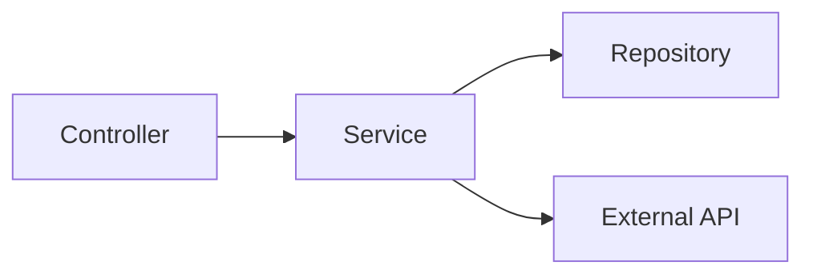
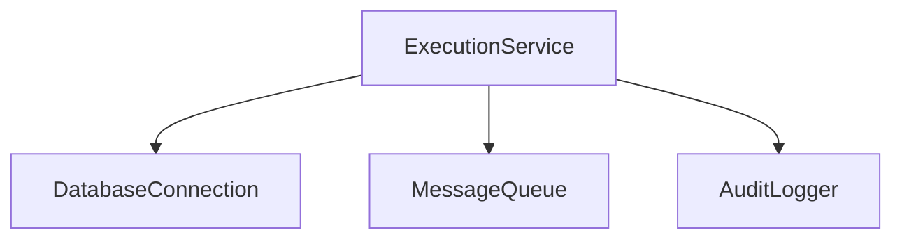

# Generate Entity Context Documentation

## Skill Overview
This skill guides the creation of standardized `CONTEXT.md` files within feature modules. These files serve as technical briefings for AI entities, providing structured, scannable documentation about feature implementation.

## When to Use
- Creating new features that will require entity maintenance
- Documenting existing features for entity consumption
- Standardizing technical documentation across the codebase
- User invokes: `/generate-entity-context` or similar command

## Skill Execution Steps

### 1. Identify Feature Location
Ask the user which feature/module needs documentation, or accept it as a parameter.

### 2. Analyze Feature Structure
Scan the feature directory to identify:
- Entry point files (main components, index files)
- Services and API integration files
- State management files (stores, composables)
- Test files location
- Key dependencies (imports analysis)

### 3. Create `__entity__/` Directory
Create the standardized directory at the feature root:
```
[feature-path]/__entity__/CONTEXT.md
```

### 4. Generate CONTEXT.md Using Template

Use the following template structure:

```markdown
# [Feature Name]

## Quick Facts
- **Purpose**: [one-line description of what this feature does]
- **Owner**: [team or person responsible]
- **Status**: [stable|experimental|deprecated]
- **Entry Point**: `path/to/main/file.ext`

## Architecture



## Key Files
| File | Purpose | Pattern Used |
|------|---------|--------------|
| `ExecutionController.java` | HTTP endpoint handler | REST controller |
| `ExecutionService.java` | Business logic layer | Service layer pattern |
| `ExecutionRepository.java` | Data access layer | Repository pattern |
| `ExecutionTypes.java` | Domain models | DTO/Entity definitions |

## Implementation Patterns

**Data Access**: [Pattern used - e.g., JPA repository with transaction management]
**API Integration**: [How external APIs are called - e.g., Via `HttpClient` with retry logic]
**Error Handling**: [Error handling approach - e.g., Custom exceptions with @ControllerAdvice]
**Testing**: [Testing approach - e.g., Spock with Mockito in `src/test/`]
**Validation**: [Validation approach - e.g., Bean Validation annotations]

## Critical Context
> Important information entities must know before modifying this feature

- [Gotcha #1: e.g., Execution requires active database transaction]
- [Gotcha #2: e.g., Timeout is configurable via application.properties]
- [Business Logic: e.g., Failed executions retry 3x with exponential backoff]
- [Performance: e.g., Batch processing uses pagination - do not load all records]

## Dependencies



## Common Tasks

### Add new [execution type]
1. Update `ExecutionType` enum in `ExecutionTypes.java`
2. Add handler method in `ExecutionService.java`
3. Update `ExecutionController.java` endpoint mapping
4. Add test in `src/test/.../ExecutionServiceTest.java`

### Debug [failed execution]
- Check database logs for transaction errors
- Verify message queue connectivity in application logs
- Review `ExecutionAuditLog` table for execution history

### Modify [execution workflow]
1. Update business logic in `ExecutionService.java`
2. Modify validation rules if needed
3. Update integration tests to cover new workflow

## References
- **Conventions**: [Relevant conventions] (see CLAUDE.md)
- **Architecture**: [Relevant architecture] (see `.claude/docs/architecture.md#section`)
- **Testing**: [Relevant testing approach] (see `.claude/docs/testing-guidelines.md#section`)
```

### 5. Populate Template Sections

#### Quick Facts
- Extract feature purpose from code analysis or ask user
- Determine status based on code maturity
- Identify entry point file

#### Architecture Diagram
- Analyze imports to understand component relationships
- Generate Mermaid diagram showing main data flow
- Aim for 4-7 nodes when the feature has meaningful relationships to show; for simple features, accuracy takes precedence — do not pad nodes artificially to hit a number

#### Key Files Table
- List 4-8 most important files
- Describe each file's purpose concisely
- Identify which pattern each file follows

#### Implementation Patterns
- Analyze code to identify:
  - Data access approach (JPA/JDBC/ORM patterns)
  - API integration pattern (service layer, direct calls, etc.)
  - Error handling mechanism
  - Testing strategy
  - Validation approach

#### Critical Context
- Ask user about non-obvious behavior
- Identify gotchas from code analysis (hardcoded values, timeouts, etc.)
- Note business logic requirements
- Document performance considerations

#### Dependencies Diagram
- Analyze imports to identify external dependencies
- Create Mermaid diagram showing dependency relationships
- Focus on significant dependencies only

#### Common Tasks
- Generate 2-4 common task procedures
- Base on typical operations for this feature type
- Provide concrete, step-by-step instructions

#### References
- Link to relevant sections in centralized docs
- Be specific (include anchor links)

### 6. Review and Validate
- Ensure all Mermaid diagrams are valid
- Verify file paths are correct
- Check that tables are properly formatted
- Confirm references to centralized docs are accurate

### 7. Self-Verification

Before presenting the CONTEXT.md to the user, complete the verification checklist in [VERIFICATION-CHECKLIST.md](VERIFICATION-CHECKLIST.md).

The checklist covers:
- **Content Completeness**: All required sections populated
- **Format Quality**: Proper markdown and structure
- **Technical Accuracy**: Code alignment verification
- **Entity Usability**: Scanability and actionability
- **Consistency**: Standards adherence

All 25 checklist items must pass before presenting to the user.

### 8. Present to User
Show the generated `CONTEXT.md` and:
- Highlight sections that need user input
- Ask user to validate critical context
- Offer to adjust any section

## Output Requirements

The generated `CONTEXT.md` must:
- Use proper Markdown formatting
- Include valid Mermaid diagrams
- Use tables for structured data
- Keep prose to minimum (bullet points preferred)
- Be approximately 50-150 lines depending on feature complexity
- Be scannable (entity should extract key info in <30 seconds)

## Example Invocation

**User**: `/generate-entity-context src/services/execution`

**Entity Response**:
1. Analyzes `src/services/execution/` directory
2. Identifies key files, patterns, dependencies
3. Asks clarifying questions about critical context
4. Generates `src/services/execution/__entity__/CONTEXT.md`
5. Presents result for user validation

## Quality Guidelines

**Do:**
- Keep diagrams simple and focused
- Use tables over paragraphs
- Provide actionable procedures
- Link to centralized docs for detailed patterns
- Focus on what entities need to know, not what humans need

**Don't:**
- Write essay-style documentation
- Include historical context (not an ADR)
- Over-explain obvious code
- Create complex diagrams with 10+ nodes
- Duplicate content from centralized docs

## Notes
- This format is optimized for entity consumption, not human reading
- The `README.md` in the feature directory should serve human developers
- `CONTEXT.md` is about operational facts, not decision rationale
- Update `CONTEXT.md` when significant changes occur to the feature